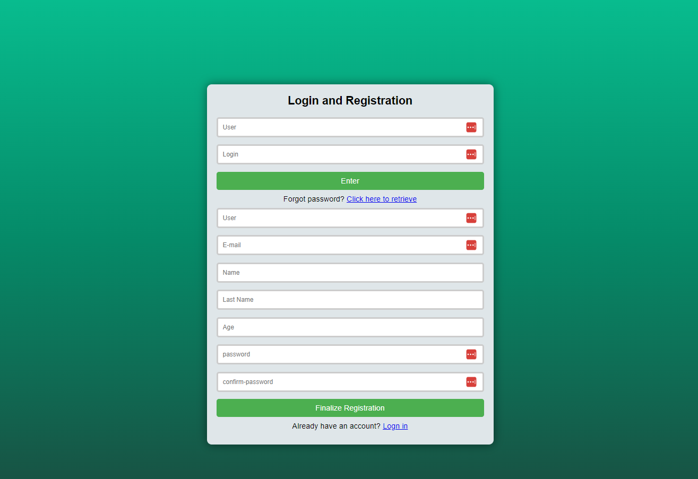

  

# Formulário de Login e Cadastro Responsivo

Este é um exemplo simples de formulário de login e cadastro responsivo, desenvolvido utilizando HTML5, CSS3.

## Funcionalidades

O formulário apresenta as seguintes funcionalidades:

- Área de login com campos para e-mail e senha.
- Área de cadastro com campos para nome, sobrenome, e-mail, idade, senha e confirmação de senha.
- Botão para alternar entre as áreas de login e cadastro.
- Validação dos campos de e-mail, idade, senha e confirmação de senha.
- Mensagens de erro para campos inválidos.
- Responsividade para diferentes tamanhos de tela.

## Tecnologias Utilizadas

O projeto foi desenvolvido utilizando as seguintes tecnologias:

- HTML5
- CSS3

## Pré-requisitos

Não há pré-requisitos para a execução deste projeto.

## Execução

Para executar o projeto, basta abrir o arquivo `index.html` em um navegador web.

## Contribuições

Contribuições são sempre bem-vindas! Se você quiser contribuir para este projeto, sinta-se à vontade para abrir uma issue ou um pull request.
